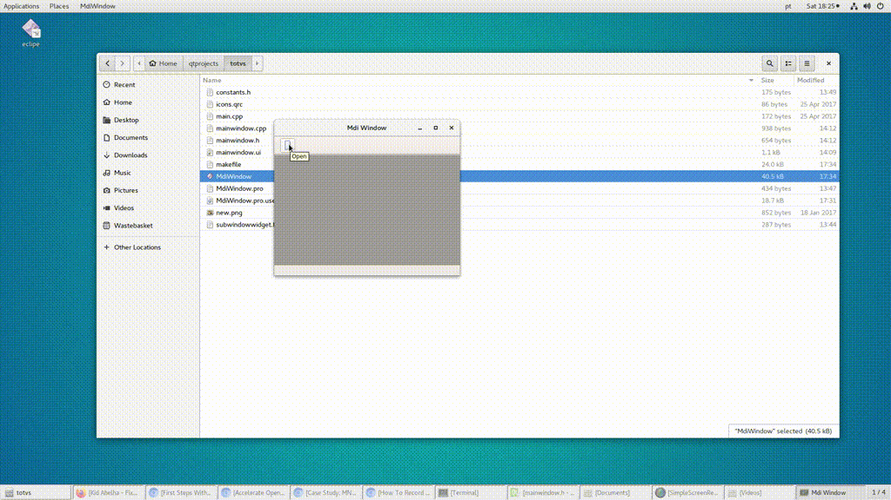

# Aplicação Qt Simples

Aplicação Qt onde é criada uma janela MDI na qual podem ser abertas uma janela principal e uma janela
de mensagem. Requisitos para executar aplicativo: Qt >=5 e Ubuntu >= 16.04

Para compilar, execute os comandos na baixo num shell linux:

```shell
qmake MdiWindow.pro -r -spec linux-g++-64 -o Makefile
make
#dai para executar
./MdiWindow
```



